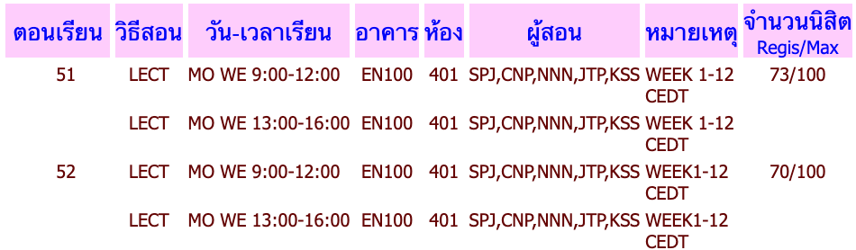

# Contributing Guidelines

## Prerequisites

This project uses Node.js for development. We are currently using version 22 LTS
or as specified in the `.nvmrc` file.

We recommend enabling `corepack` to automatically use correct version of package manager (`pnpm`)

## Database

PostgreSQL is used as the database for this project. The database schema is defined using Drizzle ORM in the `packages/database` package.

The database design is based on the data available from Data Gateway (https://datagateway.chula.ac.th, only accessible within Chula's network)

### Database Schema

`types.ts` - Shared enums

`courseData.ts` - Related to course information, relies on third-party data sources.

- `course` - Represents an instance of a course in single semester of a single study program.
- `course_info` - Represents general information about a course that is always the same every semester. (PKEY: `course_no`)
- `section` - Represents a section of a course instance.
- `section_class` - Represents each line in section detail

This image has 2 `section`s: 51 and 52. Each section has (mostly) one or more `section_class`es representing different class times which are: "LECT MO WE 9:00-12:00" and "LECT MO WE 13:00-16:00" in the above example.

`userData.ts` - Related to user data, only stored in and related to CU Get Reg.

- `user` - Represents a user of CU Get Reg. One user is coupled to a google account.
- `cart` - Represents a cart of a user, think of it as one schedule.
- `cart_item` - Represents an item in a cart.
- `review` - Represents a single review.
- `review_votes` - Represents upvote/downvote on a review by a user.

### Seeding Database

- First, make sure your local postgres is ready. Using Docker/OrbStack is highly recommended.
- Get Course Data V1 (Dumped) from [Here](https://drive.google.com/drive/folders/1L8h4JCXYfC6oYdHY66nPfbfcfCZDLtmq?usp=sharing), this will contain two files: `courses.json` and `overrides.json`, put them under `packages/database/data`.
- There is `users.json` and `reviews.json` but since it contains real user personal data, this is only limited to core contributors. If you don't have this data, you can comment a part of seed script (`src/seed/index.ts`) to avoid errors.
- Run `pnpm migrate` to apply to local postgresql instance
- Run `pnpm seed` to seed the database

## Developing

Most of the time, you will be working on core website `apps/web`, since it is a full-stack application, both frontend and backend logic are here.

If you have already installed dependencies and database is set up, you can start development server by running `pnpm web:dev`.

### UI Library and Storybook

Located in `packages/ui` and `apps/storybook`

UI Library is based on [shadcn-svelte](https://shadcn-svelte.com) and TailwindCSS.

When you add a new component, it will appear on `src/ui`, please move it to appropriate folder in `src/components`, you can read about Atomic Design Methodology [here](https://atomicdesign.bradfrost.com/chapter-2/).

> [!WARNING]
> Make sure imports from utils are `@repo/ui/utils` (no `.js`)

Please specify in the description whether this is a component directly from shadcn or a derived components or entirely original component.

To run storybook, run: `pnpm storybook:dev`

## Styles and Rules

We have linting tools set: ESLint and Prettier. You can run `pnpm format` to auto-format the code and run `pnpm lint` to check for linting errors.
